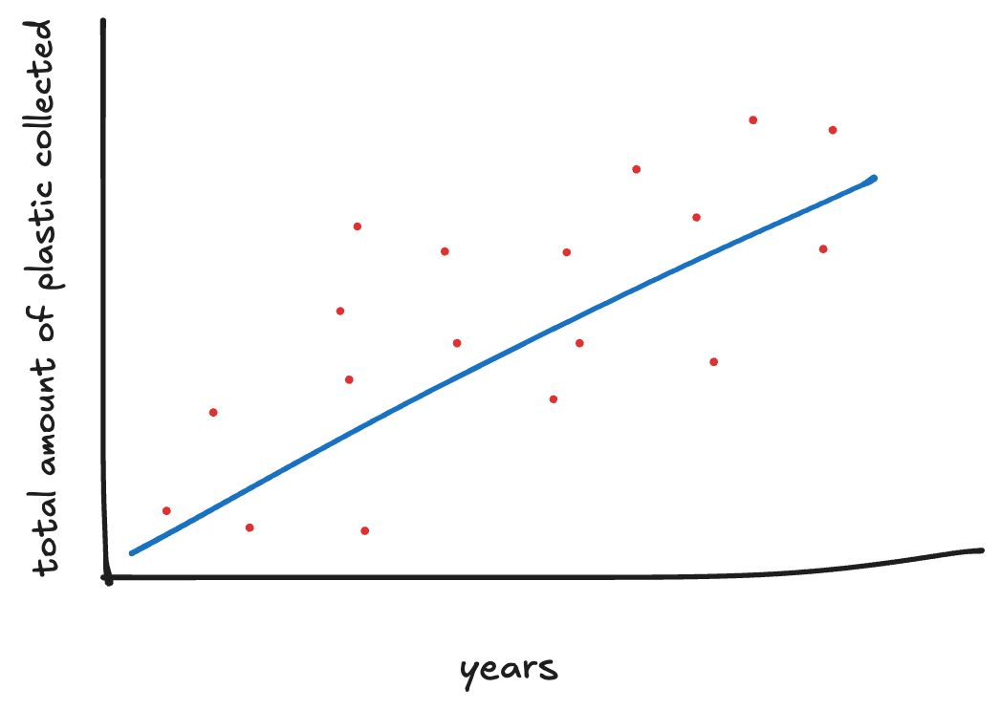

```{r}
library(tidyverse)
library(dplyr)
```

## Context

The Environmental Plastic Waste Data comes from the **"Break Free from Plastic"** movement and covers information on plastic use across the world, organized by country, type of plastic, source of plastic, and year (2019 or 2020). The data comes from brand audits and cleanups conducted by volunteers. Some limitations of this dataset are that the countries will not have an equal sampling effort and the data depends on volunteer participation. Additionally, the amount of collected waste does not necessarily tell us how much plastic there is in general. Aside from those, the data is useful to help identify major corporate contributors to plastic pollution in our environment. It can also help inform environmental policy workers and provide corporate accountability.

## Data Cleaning

It seems as though initially the 2019 and 2020 datasets were imported separately from directories. Only the csv files were chosen from those respective directories. We then read the two CSV files with specified column types to prevent any confusion. The code then combines multiple files into a single file for each year (one for 2019 and one for 2020) through `map_dfr`. Next, the code cleans column names for both files using the `janitor::clean_names()` command, and makes the names consistent across years. A year column is also added to the datasets.

Individual Changes:

2020:

-   The `Grand_Total` variable is converted from character to numeric.

2019:

-   The country names are extracted from file names & stored in a `country` column.

-   Combines duplicate columns `pp_2` and `pp` as well as `ps` & `ps_2`.

-   Handles missing values using `is.na` and an `ifelse()` statement.

-   Drops `ps_2` & `pp_2`

Lastly, the 2019 and 2020 datasets are merged using `bind_rows()`and exported to a csv file.

## Research Questions

Using Current Data:

1)  Have certain plastic types (e.g. Polystyrene or High density polyethylene) become more or less common over time?

2)  How does the composition of plastic waste differ between countries?

Using Supplemental Data:

1)  Is there a relationship between a country’s GDP and the amount of branded plastic pollution collected?

2)  Do countries with stricter plastic regulations show lower counts of certain plastic types?

## Visualizations

 


# Checkpoint 2

## Reading in the Data

```{r}
plastics <- readr::read_csv('https://raw.githubusercontent.com/rfordatascience/tidytuesday/main/data/2021/2021-01-26/plastics.csv')
```

## Proportion of Polyester Plastic Between 2019 & 2020 By Country

*New Column: proportion of Polyester Plastics for each year*

*Uses iteration, no custom function*
```{r}

pet_props <- plastics |> 
  group_by(year, country) |>
  summarize(
   prop = sum(pet, na.rm = TRUE)/sum(grand_total, na.rm = TRUE)
   )
pet_props

```

*Custom Function*

```{r}
#| echo: true
#| output: false
Yearly_PET_Prop <- function(input_country){
  pet_props |>
    filter(country == input_country) 
}

countries <- plastics |> 
  distinct(country) |>
  pull(country)
  
result <- countries |>
  map(.f = Yearly_PET_Prop) |>
  set_names(countries)

```
<details> <summary>Show table output</summary>

```{r}
#| echo: false

result
```

Seems like a significant reduction in Polyester Plastics collected in Argentina. 

## Low & High Density Polyethylene Total Count Per Year

*No new columns*

*Requires custom function*

```{r}
sum_pe <- function(input_country){
  plastics |> 
    group_by(year) |>
    filter(country == input_country) |>
    summarize(
      ldpe_total = sum(ldpe, na.rm = TRUE), 
      hdpe_total = sum(hdpe, na.rm = TRUE),                
      .groups = "drop"
      )
}

#Test Case
sum_pe("Brazil")
```

*Iteration*
```{r}
#| echo: true
#| output: false
 
result <- countries |>
  map(.f = sum_pe) |>
  set_names(countries)

```
<details> <summary>Show table output</summary>

```{r}
#| echo: false

result
```


#Checkpoint 3

```{r}
#| label: install-load-packages
library(httr)
library(tidyjson)
library(jsonlite)
library(tidyverse)
library(glue)
library(purrr)
library(countrycode)
```

## Temperature Data Set (Additional Country-Level Data)

```{r}
#| label: read-in-temp-data

# Read in Temperature data set
temp <- read.csv("combined_temperature.csv")

temp <- temp |>
  filter(Year %in% (c(2019, 2020)),)

# Show first 10 rows of temp data set
head(temp, 10)
```

The temperature data set includes data on the mean annual temperatures for all countries worldwide for the years 1901-2022, but we are particularly interested in the years 2019 and 2020. The 3-letter ISO code for each country is also included. We chose this data set because we wanted to explore how climate affects plastic degradation and consumption across different countries around the world.


## GDP Data Set (Additional Country-Level Data)

```{r}
#| label: api-key

my_key <- "jeQXhjaZCd6IqE2oCz6WDemzfY37kMfnIUN2Obul"
```

```{r}
#| label: gdp-data-api

get_gdp <- function(country, key = my_key) {
  safe_parse <- safely(
    function(country, key) {

      response <- GET(
        url = "https://api.api-ninjas.com/v1/gdp",
        query = list(country = country),
        add_headers("X-Api-Key" = key)
      )

      data <- content(response, as = "text", encoding = "UTF-8")
      fromJSON(data)
    }
  )

  out <- safe_parse(country, key)

  # if there was an error, return empty data frame
  if (!is.null(out$error)) {
    return(data.frame())
  }

  # if result is empty, return empty data frame
  if (length(out$result) == 0) {
    return(data.frame())
  }

  # force result into data frame
  as.data.frame(out$result) |> 
    filter(year %in% c(2019, 2020))
}

# Test Case
# can call function with 2-letter ISO code (get_gdp("CA")) or with full country name:
get_gdp("Canada")
```

```{r}
#| label: combine-lists-into-df
gdp <- map_dfr(unique(temp$Code), get_gdp)
head(gdp, 10)
```

The original GDP data set includes historical, current, and predicted data on GDP for countries around the world for the years for 1980-2029. We are particularly interested in the years 2019 and 2020. The 3-letter ISO code for each country is also included. There are 5 variables measuring GDP in different ways. For example, the variable `gdp_per_capita_nominal` measures GDP by dividing the country's total value of finished goods and services by its total population. `gdp_nominal` is the nominal GDP in billions of US dollars and `gdp_growth` expresses the GDP growth rate as a percentage. 


## "Meta" Dataset: Combining Temperature, GDP, and Plastic Waste Data Sets

```{r}
#| label: combine-temp-gdp-data
# Keep gdp_per_capita_nominal variable
gdp_per_capita <- gdp |>
  select(country, year, gdp_per_capita_nominal)

# Remove X5.yr.smooth variable from temperature data, join with gdp data set
combined <- temp |>
  select(-X5.yr.smooth) |>
  left_join(gdp_per_capita, by = c("Code" = "country", "Year" = "year"))
```

```{r}
#| label: clean-plastics

# Sum up plastic and grand total plastic counts for each country, for each year
plastics_sum <- plastics |>
  group_by(country, year) |>
  summarize(
    across(empty:grand_total, sum, na.rm = TRUE),
    num_events = first(num_events),
    volunteers = first(volunteers),
    .groups = "drop"
  )
```

```{r}
#| label: combine-plastics-temp-gdp
plastics_sum <- plastics_sum |>
  filter(!(country == "EMPTY")) |>
  mutate(Code = countrycode(
    sourcevar = country, 
    origin = "country.name", 
    destination = "iso3c"))
```                       

```{r}
#| label: data-summaries-viz
```

